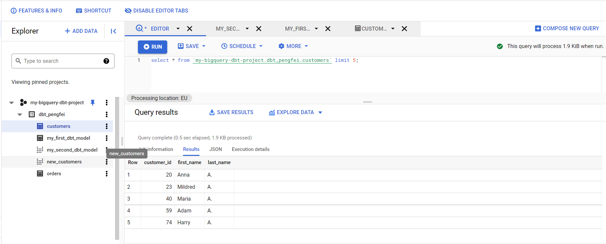
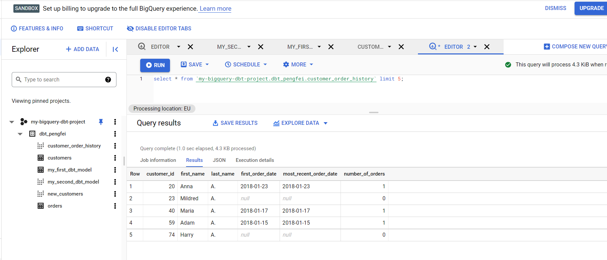
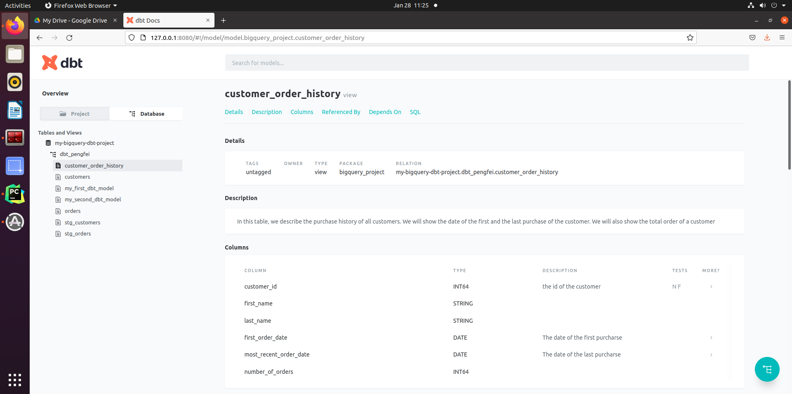

# dbt bigquery project

## 0. Install dbt

To install dbt, you can follow the official doc [here](https://docs.getdbt.com/dbt-cli/install/pip). As I use poetry, 
so for me the commands are

```shell
# the dbt-core is mandatory
poetry add dbt-core

# the connector is optional, you only need to install the connector that you need
# for this project I will use bigquery, so I install
poetry add dbt-bigquery

# If I want to use postgres as db, I will install 
poetry add dbt-postgres
```

## 1. Create a dbt project

Below command allows you to create a dbt project

```shell
dbt init bigquery_project
```

### 1.1 Database connector

It will prompt some question based on the database connector that you choose. Based on your answers, it will generate
a database connector config in ~/.dbt/profiles.yaml

For example for the bigquery connector, you should have something similar to below code:
```yaml
gcp_bigquery: # this needs to match the profile: in your dbt_project.yml file
  target: dev
  outputs:
    dev:
      type: bigquery
      method: service-account
      keyfile: /home/pliu/creds/dbt-user-gcp-bigquery-sc.json # replace this with the full path to your gcp service account keyfile
      project: my-bigquery-dbt-project # Replace this with your project id
      dataset: dbt_pengfei # Replace this with your dataset name e.g. dbt_bob
      threads: 1
      timeout_seconds: 300
      location: EU
      priority: interactive

```

This file allows dbt to connect to the gcp bigquery API.

To test the validity of the config, you can use
```shell
dbt debug
```

If the config is correct, you should see:
```text
Connection:
  method: service-account
  database: my-bigquery-dbt-project
  schema: dbt_alice
  location: EU
  priority: interactive
  timeout_seconds: 300
  maximum_bytes_billed: None
  execution_project: my-bigquery-dbt-project
  Connection test: [OK connection ok]

```

### 1.2 Project layout
The init command also generates many folders and files:

```text
├── logs
│ └── dbt.log
├── my_dbt_project
│ ├── analyses
│ ├── data
│ ├── dbt_project.yml
│ ├── macros
│ ├── models
│    │   └── example
│    ├── README.md
│    ├── snapshots
│    └── tests

```

logs : is the folder to store the logs of dbt, when you run a dbt command via CLI, it will create a logs folder.

my_dbt_project: is the folder to store all the information about my dbt project
- analyses: You can store sql query for analyzing your data
- data: You can store some data you need to load into your database, deprecated, need to use seeds to store csv now 
- dbt_project.yml: is the main configuration file of your project. We will examine it with details
- macros: Dbt allows users to create macros, which are sql based functions. These macros can be reused across the 
          project.
- models: **model is the most import concept in dbt.** Model is a select statement that contains the logic of 
          data transformation. Each model is defined in .sql files (in models directory):
    - The name of the file is used as the model name
    - Models can be nested in subdirectories within the models directory
    - When you execute the dbt run command, dbt will build this model in your data warehouse by wrapping it in a 
      create view as or create table as statement.

### 1.3 The project config file

As we mentioned before, **dbt_project.yml** is the project config file. It contains:
- project name, version, config-file version
- profile: specify which credential will be used to connect to the target database server
- *-paths: specify where dbt should look for different types of files.
- models: specify how the models that you defined in your project will be materialized in your database server. It 
         could be a table or a view.
```yaml

# Name your project! Project names should contain only lowercase characters
# and underscores. A good package name should reflect your organization's
# name or the intended use of these models
name: 'postgres_project'
version: '1.0.0'
config-version: 2

# This setting configures which "profile" dbt uses for this project.
profile: 'postgres_project'

# These configurations specify where dbt should look for different types of files.
# The `model-paths` config, for mart, states that models in this project can be
# found in the "models/" directory. You probably won't need to change these!
model-paths: ["models"]
analysis-paths: ["analyses"]
test-paths: ["tests"]
seed-paths: ["seeds"]
macro-paths: ["macros"]
snapshot-paths: ["snapshots"]

target-path: "target"  # directory which will store compiled SQL files
clean-targets:         # directories to be removed by `dbt clean`
  - "target"
  - "dbt_packages"


# In this mart config, we tell dbt to build all models in the mart/ directory
# as views. These settings can be overridden in the individual model files
# using the `{{ config(...) }}` macro.
models:
  bigquery_project:
    # Config indicated by + and applies to all files under models/example/
    # all models under example folder will be saved as view in bigquery
    example:
      +materialized: view
    # all models under mart folder will be saved as table in bigquery
    mart:
      +materialized: table
```

## 2. Run your dbt model 

As dbt generates some example models to allow you to create views or tables in the database, you can already create some
table/view into the database server. To do so, run:
```shell
dbt run
```
You will see below output in the terminal:
```text
10:40:19  1 of 2 START table model dbt_pengfei.my_first_dbt_model......................... [RUN]
10:40:21  1 of 2 OK created table model dbt_pengfei.my_first_dbt_model.................... [CREATE TABLE (2.0 rows, 0 processed) in 2.57s]
10:40:21  2 of 2 START view model dbt_pengfei.my_second_dbt_model......................... [RUN]
10:40:22  2 of 2 OK created view model dbt_pengfei.my_second_dbt_model.................... [OK in 1.07s]
```

You can check the gcp bigquery console, you should see you have two tables in your project now.


## 3 Load static csv file

dbt provides a feature called **seed** to upload a csv file to the database server as a table or view.

You need to do 3 things:

1. check if your dbt_project.yml contains the seed config. You should have below line 
```yaml
seed-paths: ["seeds"]
```
2. Create a folded called **seeds** under the parent root folder, then put your csv file under **seeds**.
3. To upload csv file you need to run
```shell
# this will upload all csv inside the folder
dbt seed

# if you have multiple csv files, but you only want to load a specific csv, you can use below command. it's buggy
# to run this command, so use it with caution
dbt seed --select customers.csv

```

You should see new tables created at the bigquery server. Below figure is an example


**Important note: Pay attention of the csv file name, it can't have the same name with other models. Because they will
all translated into tables/views. The same name will cause conflict**

## 4. Write a custom model

In section 2, we run the generated model to test the project configuration. Now let's write our own model to do some
actual data transformation

### 4.1 Use the seeds in models

As I mentioned before, seeds will be loaded to the target database as a table or view(based on your project configuration).
As a result, it can be referenced as a model.

In below model, we want to calculate the date of first_order, most_recent_order and order_count of each user. As we load
customers.csv and orders.csv as seeds, we can use **{{ ref('customers')}}** and {{ ref('orders') }} to invoke the table.
otherwise, I have to use the full path **my-bigquery-dbt-project.dbt_pengfei.customers**. The reference can avoid not
only many typing, but also a higher level of abstraction of table, I no longer need to pay attention of the table location 
(e.g. project, database_name), dbt will control them for me. 

```sql
with customers as (
    select
        customer_id,
        first_name,
        last_name
    from {{ ref('customers') }}

),
orders as (
    select
        order_id,
        customer_id,
        order_date,
        status

    from {{ ref('orders') }}

),
customer_orders as (
    select
        customer_id,
        min(order_date) as first_order_date,
        max(order_date) as most_recent_order_date,
        count(order_id) as number_of_orders
    from orders
    group by 1

),
final as (
    select
        customers.customer_id,
        customers.first_name,
        customers.last_name,
        customer_orders.first_order_date,
        customer_orders.most_recent_order_date,
        coalesce(customer_orders.number_of_orders, 0) as number_of_orders
    from customers
    left join customer_orders using (customer_id)
)

select * from final
```
After you run **dbt run**, you should see a new table/view customer_order_history in the bigquery server. Below figure
is an example



### 4.2 Change the schema of the table

In this tutorial, we use bigquery as database server, which does not have notion of schema inside a database. But other
database server such as postgresql does have schema. The simplest way is to change **the schema: parameter in your profiles.yml file**.

For multiple schema setup, please visit this [page](https://docs.getdbt.com/docs/building-a-dbt-project/building-models/using-custom-schemas)

## 5. Understand the dbt inner working

You could notice the sql file inside models are not exactly standard sql. It has extra syntax such as reference. So
when you execute **dbt run**, dbt will parse the sql files in models to actual sql file which is compatible with the
target database server (bigquery for this tutorial). 

Most of the time, you don't need to pay attention on the generated sql file, but when you encounter bugs that you don't 
understand, you may check the generated sql to understand which sql query will be actually executed.

There are three locations you can check the generated sql queries:
- In the target/compiled/ directory, you can find compiled select statements
- In the target/run/ directory, you can find compiled create statements
- In the logs/dbt.log file, you can find verbose logging of the query execution.

## 6. Test and document your table

Adding tests to your models helps validate that your models are working correctly. But for now dbt only supports
four possible tests:
- not_null: This test validates that there are no null values present in a column.
- unique: This test validates that there are no duplicate values present in a field.
- accepted_values: This test validates that all of the values in a column are present in a supplied list of values. 
                 If any values other than those provided in the list are present, then the test will fail.
- relationships: This test validates that all the records in a child table have a corresponding record in a 
               parent table. This property is referred to as "referential integrity".

For more details about test, please visit the official [doc](https://docs.getdbt.com/reference/resource-properties/tests)

### 6.1 Create test suites

The test suites for models in dbt must be in a yaml file, you can name it as you want. But by convention, we normally
name it as schema.yaml.

Below is an example of the test suite
```yaml
version: 2
seeds:
  - name: customers # this test if the column customer_id in customers (seed) is unique and not null
    columns:
      - name: customer_id
        tests:
          - unique
          - not_null

models:
  - name: stg_customers
    columns:
      - name: customer_id
        tests:
          - unique
          - not_null

  - name: stg_orders
    columns:
      - name: order_id
        tests:
          - unique
          - not_null
      - name: status
        tests:
          - accepted_values:
              values: ['placed', 'shipped', 'completed', 'return_pending', 'returned']
      - name: customer_id
        tests:
          - not_null
          - relationships:
              to: ref('stg_customers')
              field: customer_id
```

You can notice that it has two major sections:
- seeds: add test for seeds (csv files)
- models: add test for models (table/view)

### 6.1.1 Test seeds
For the seeds, it's quite simple. We test if the column customer_id in customers (seed) is unique and not null

```yaml
seeds:
  - name: customers # this test if the column customer_id in customers (seed) is unique and not null
    columns:
      - name: customer_id
        tests:
          - unique
          - not_null
```

### 6.1.2 Test models

To test models, we created two staging table for seeds.
The stg_customers.sql file:
```sql
with stg_customers as (
    select
        customer_id,
        first_name,
        last_name
    from {{ ref('customers') }}
)

select * from stg_customers
```
The stg_orders.sql file:
```sql
with stg_orders as (
    select
        order_id,
        customer_id,
        order_date,
        status
    from {{ ref('orders') }}
)

select * from stg_orders
```

#### Model test rule details:

For stg_customers, We test if the column customer_id is unique and not null

For stg_orders:
- We test if the column order_id is unique and not null
- We test if the column status only contains value in list ['placed', 'shipped', 'completed', 'return_pending', 'returned']
- We test if the column customer_id is not null and the values have corresponding record in stg_customers.customer_id 
```yaml
models:
  - name: stg_customers
    columns:
      - name: customer_id
        tests:
          - unique
          - not_null

  - name: stg_orders
    columns:
      - name: order_id
        tests:
          - unique
          - not_null
      - name: status
        tests:
          - accepted_values:
              values: ['placed', 'shipped', 'completed', 'return_pending', 'returned']
      - name: customer_id
        tests:
          - not_null
          - relationships:
              to: ref('stg_customers')
              field: customer_id
```

### 6.2 Run test

To run test, you run
```shell
dbt test
```
You should see below output
```text
18:45:58  1 of 9 START test accepted_values_stg_orders_status__placed__shipped__completed__return_pending__returned [RUN]
18:45:59  1 of 9 PASS accepted_values_stg_orders_status__placed__shipped__completed__return_pending__returned [PASS in 0.92s]
18:45:59  2 of 9 START test not_null_customers_customer_id................................ [RUN]
18:46:00  2 of 9 PASS not_null_customers_customer_id...................................... [PASS in 1.00s]
18:46:00  3 of 9 START test not_null_stg_customers_customer_id............................ [RUN]
18:46:01  3 of 9 PASS not_null_stg_customers_customer_id.................................. [PASS in 0.92s]
18:46:01  4 of 9 START test not_null_stg_orders_customer_id............................... [RUN]
18:46:02  4 of 9 PASS not_null_stg_orders_customer_id..................................... [PASS in 0.90s]
18:46:02  5 of 9 START test not_null_stg_orders_order_id.................................. [RUN]
18:46:03  5 of 9 PASS not_null_stg_orders_order_id........................................ [PASS in 0.98s]
18:46:03  6 of 9 START test relationships_stg_orders_customer_id__customer_id__ref_stg_customers_ [RUN]
18:46:04  6 of 9 PASS relationships_stg_orders_customer_id__customer_id__ref_stg_customers_ [PASS in 0.94s]
18:46:04  7 of 9 START test unique_customers_customer_id.................................. [RUN]
18:46:05  7 of 9 PASS unique_customers_customer_id........................................ [PASS in 0.89s]
18:46:05  8 of 9 START test unique_stg_customers_customer_id.............................. [RUN]
18:46:05  8 of 9 PASS unique_stg_customers_customer_id.................................... [PASS in 0.92s]
18:46:05  9 of 9 START test unique_stg_orders_order_id.................................... [RUN]
18:46:06  9 of 9 PASS unique_stg_orders_order_id.......................................... [PASS in 0.93s]
18:46:06  
18:46:06  Finished running 9 tests in 8.72s.
18:46:06  
18:46:06  Completed successfully
18:46:06  
18:46:06  Done. PASS=9 WARN=0 ERROR=0 SKIP=0 TOTAL=9

```

### 6.3 Add documentation
Adding documentation to your project allows you to describe your models in rich detail, and share that information with 
other data consumers.

You can add documentation (descriptions) to each model(table/view) and column. Below is an example
```yaml
models:
  - name: customers
    description: One record per customer # add a description to the table
    columns:
      - name: customer_id
        description: Primary key # add a description to column customer_id
        tests:
          - unique
          - not_null
      - name: first_order_date
        description: NULL when a customer has not yet placed an order. # add a description to column first_order_date
```

#### 6.3.1 Generate doc

Execute below code to generate the documentation for your project. dbt introspects your project and your warehouse 
to generate a json file with rich documentation about your project.

```shell
dbt docs generate
```

After running above commands, you should see something like :
```text
19:18:39  Running with dbt=1.0.1
19:18:39  Found 5 models, 11 tests, 0 snapshots, 0 analyses, 188 macros, 0 operations, 2 seed files, 0 sources, 0 exposures, 0 metrics
19:18:39  
19:18:40  Concurrency: 1 threads (target='dev')
19:18:40  
19:18:40  Done.
19:18:40  Building catalog
19:18:43  Catalog written to /home/pliu/git/DBTTutorial/bigquery_project/target/catalog.json
```

You can notice the output doc is a json file, and it's stored in /target folder.

To view the generated doc, you can run
```shell
dbt docs serve
```

This command will render the generated docs in a local web page. Below figure is an example
