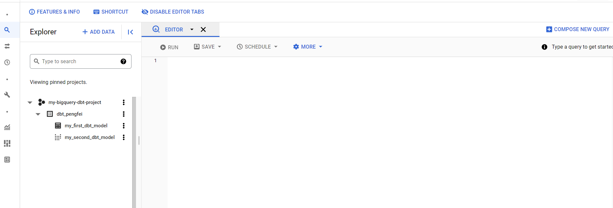

# dbt bigquery project

## 1. Create a dbt project

Below command allows you to create a dbt project

```shell
dbt init bigquery_project
```

It will prompt some question based on the database connector that you choose. Based on your answers, it will generate
a database connector config in ~/.dbt/profiles.yaml

For example for the bigquery connector, you should have something similar to below code:
```yaml
gcp_bigquery: # this needs to match the profile: in your dbt_project.yml file
  target: dev
  outputs:
    dev:
      type: bigquery
      method: service-account
      keyfile: /home/pliu/creds/dbt-user-gcp-bigquery-sc.json # replace this with the full path to your gcp service account keyfile
      project: my-bigquery-dbt-project # Replace this with your project id
      dataset: dbt_pengfei # Replace this with your dataset name e.g. dbt_bob
      threads: 1
      timeout_seconds: 300
      location: EU
      priority: interactive

```

This file allows dbt to connect to the gcp bigquery API.

To test the validity of the config, you can use
```shell
dbt debug
```

If the config is correct, you should see:
```text
Connection:
  method: service-account
  database: my-bigquery-dbt-project
  schema: dbt_alice
  location: EU
  priority: interactive
  timeout_seconds: 300
  maximum_bytes_billed: None
  execution_project: my-bigquery-dbt-project
  Connection test: [OK connection ok]

```

## 2. Run your dbt model 

As dbt generates some example models to allow you to create views or tables in the database, you can already load some
data into the database server. To do so, run:
```shell
dbt run
```
You will see below output in the terminal:
```text
10:40:19  1 of 2 START table model dbt_pengfei.my_first_dbt_model......................... [RUN]
10:40:21  1 of 2 OK created table model dbt_pengfei.my_first_dbt_model.................... [CREATE TABLE (2.0 rows, 0 processed) in 2.57s]
10:40:21  2 of 2 START view model dbt_pengfei.my_second_dbt_model......................... [RUN]
10:40:22  2 of 2 OK created view model dbt_pengfei.my_second_dbt_model.................... [OK in 1.07s]
```

You can check the gcp bigquery console, you should see you have two tables in your project now.



## 3 Load static csv file

dbt provides a feature called seed to upload a csv file to the database server as a table or view.

You need to do 3 things:

1. check if your dbt_project.yml contains the seed config. You should have below line 
```yaml
seed-paths: ["seeds"]
```
2. Create a folded called **seeds** under the parent root folder, then put your csv file under **seeds**.
3. To upload csv file you need to run
```shell
# this will upload all csv inside the folder
dbt seed

# if you have multiple csv files, but you only want to load a specific csv
dbt seed --select customers.csv

```

You should see a new table created at the bigquery server.

**Important note: Pay attention of the csv file name, it can't have the same name with other models. Because they will
all translated into tables/views. The same name will cause conflict**

## 4. Use the l
