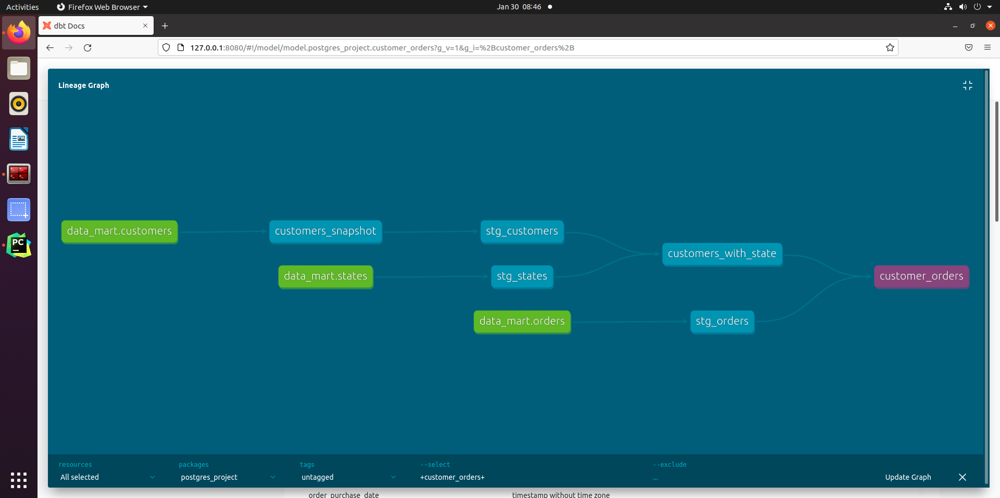

# Postgres dbt tutorial

In previous tutorial, we used dbt to load csv into bigquery database(seeds), then we have done some data transformation(models). In 
this tutorial, we will use postgresql as database server(data warehouse). Instead of loading external csv, we will query
tables (sources) that are already inside the data warehouse.


## 0. Setup postgresql database for this server

To install a postgresql server on ubuntu, please follow this [doc](https://github.com/pengfei99/K8sCronJobPostgresBackup/blob/main/docs/Install_postgresql_server_ubuntu.md)

Then you can use this [playbook](../Load_csv_to_postgres.ipynb) to upload csv to the postgresql server.

## 1 create a dbt project

To create a dbt project, use below command: (dbt_project is the name of your project, you can name it as you want)

```shell
dbt init postgres_project
```

After you entered the command, it will ask you which type of database server you will connect to. You need to install
the needed db connector before you create a project. If the connector is installed, you should see it's number. Then
entered the number in the prompt.

**For more details about the project config and layout, please check section 1 of [bigquery_project](../bigquery_project/README.md)**


## 2 Set up db credentials in profiles.yml

To read data from postgres, you need to set up credential to connect to the database server. By default, dbt stores 
these credentials in **~/.dbt/profiles.yml**. 

Below is an example of the generated profiles.yml. It can contain multiple profiles(credentials). Each profile starts with the
name, then followed by a dev and prod credentials. Note for each project you created, dbt will generate a profile for
the project. 

```yaml
# name of the profile
my_dbt_project:
  outputs:

    dev:
      type: postgres
      threads: [1 or more]
      host: [host]
      port: [port]
      user: [dev_username]
      pass: [dev_password]
      dbname: [dbname]
      schema: [dev_schema]

    prod:
      type: postgres
      threads: [1 or more]
      host: [host]
      port: [port]
      user: [prod_username]
      pass: [prod_password]
      dbname: [dbname]
      schema: [prod_schema]

  target: dev

```

You need to edit this file by adding the credentials. Below is an example after adding credentials
```yaml
config:
  send_anonymous_usage_stats: False

# note even though we have set two credential dev and prod. But as we set target is dev.
# so only the dev credential will be used.
local_postgres:
  outputs:

    dev:
      type: postgres
      threads: 1
      host: 127.0.0.1
      port: 5432
      user: pliu
      pass: changeMe
      dbname: dbt_project
      schema: public

    prod:
      type: postgres
      threads: 8
      host: 10.20.30.18
      port: 5432
      user: pliu
      pass: changeMe
      dbname: prod_dbt_project
      schema: public

  target: dev

```

## 3 Read tables and reference them in dbt

dbt provides a feature called **source**. It allows you to name and describe the data (database, tables) already in 
your warehouse. By declaring these tables as sources in dbt, you can then:

- select from source tables in your models using the {{ source() }} function, helping define the lineage of your data
- test your assumptions about your source data
- calculate the freshness of your source data


### 3.1 Declaring a source

Sources are defined in .yml files. For now, I put it in the **schema.yml** which contains test and documentation of all
models

Below is an example of a source called data_mart. It reads three tables (e.g. orders, customers, states) from database
dbt_project in schema public.

```yaml
version: 2

sources:
  - name: data_mart # name of the source
    database: dbt_project # name of the physical database (postgres in this tutorial)
    schema: public # schema of the tables
    tables:
      - name: orders
      - name: customers
      - name: states

```

### 3.2 Use a source

To use a source we can call {{ source('source-name', 'table-name') }}. Below is an example of a model use a source to
create a new model.

```sql
with stg_customers as (
    select *
    from {{ source('data_mart', 'customers') }}
)

select *
from stg_customers
```

When you run **dbt run**, you should see new table/views are created (views in my case). Below graph is an example of
the generated views.


### 3.3 Add test and documentation on sources

As we showed in section 6 of [bigquery_project](../bigquery_project/README.md), we can add tests and documentations on
models, we can also add tests and doc on sources.

So we will update the source definition of section 3.1 as shown below

```yaml
version: 2

sources:
  - name: data_mart # name of the source
    database: dbt_project # name of the physical database (postgres in this tutorial)
    schema: public # schema of the tables
    description: Data from application database, brought in by an EL process.
    tables:
      - name: customers
        description: table to describe the registered customers
        columns:
        - name: customer_id 
          description: primary key, id of customer
          tests:
            - not_null
            - unique

      - name: orders
        description: details of custom's order
        columns:
        - name: order_id
          tests:
            - not_null
            - unique
        - name: customer_id
          tests:
            - relationships:
                to: source('data_mart', 'customers')
                field: customer_id
      - name: state
```

We have added documentation on database, table and column. We also added tests on column (e.g. not_null, unique, etc.).
For details about tests, please check section 6 of [bigquery_project](../bigquery_project/README.md). It's exactly the
same.

### 3.4 Run the test

```shell
dbt run
```

### 3.5 Generate doc
```shell
dbt docs generate
```

### 3.6 Render doc in web page
```shell
dbt docs serve
```


## 4. Use snapshots to track data evolution

### 4.1 What are snapshots?

Most of the table in application databases (register transactions) are mutable. For example,  Imagine you have an 
orders table where the status field can be updated as the order is processed.

Before the order is shipped, the status will be pending, after shipment, the status is updated to shipped
```text
# Before update
id	status	updated_at
1	pending	2019-01-01 

# After update
id	status	updated_at
1	shipped	2019-01-02
```

For the application database, losing the information of previous order status is acceptable, because we only want to 
know the **current state** of the order. But for data analysts, it's not acceptable, because they need to 
"look back in time" at some previous state of data to discover why some shipment takes more time than others.  

While some source data systems are built in a way that makes accessing historical data possible, this is often not 
the case. **dbt provides a mechanism, snapshots, which records changes to a mutable table over time**.

### 4.2 How dbt track data evolution?

Snapshots implement **[type-2 Slowly Changing Dimensions](https://en.wikipedia.org/wiki/Slowly_changing_dimension#Type_2:_add_new_row)** 
over mutable source tables. These Slowly Changing Dimensions (or SCDs) identify how a row in a table changes over time. 

With the above example in section 4.1, The order status changed from the "pending" state to "shipped" state, If we don't
register extra information, we've lost the information about when the order was last in the "pending" state. 
This makes it difficult (or impossible) to analyze how long it took for an order to ship. 

dbt can "snapshot" these changes to help you understand how values in a row change over time. Here's an example of 
a snapshot table for the previous example:

```text
id	status	updated_at	dbt_valid_from	dbt_valid_to
1	pending	2019-01-01	2019-01-01	2019-01-02
1	shipped	2019-01-02	2019-01-02	null
```

### 4.3 Create a dbt snapshot

#### Step 1. Creat a snapshot config file

The snapshot config file is **a select statement within the snapshot block**. This select statement defines the 
results that you want to snapshot over time. You can use sources and refs inside the snapshot config.

Below are two snapshot config to create snapshot of the table orders and customers. 

The customer snapshot uses **timestamp strategy**.
```sql


{{
    config(
      target_database='dbt_project',
      target_schema='snapshots',
      unique_key='customer_id',

      strategy='timestamp',
      updated_at='update_date',
      invalidate_hard_deletes=True,
    )
}}

select * from {{ source('data_mart', 'customers') }}


```

The order snapshot uses **check strategy**:

```sql


{{
    config(
      target_database='dbt_project',
      target_schema='snapshots',
      unique_key='order_id',

      strategy='check',
      check_cols=['order_status'],
      invalidate_hard_deletes=True,
    )
}}

select * from {{ source('data_mart', 'orders') }}


```

This file can be divided in three parts:

**Part 1 snapshot block**
The snapshot block defines the start and end of a snapshot, and the name of the generated snapshot table. In this 
example, the table name is **orders_snapshot** 

```text



```

**Part 2 select statement**

This select statement defines the results that you want to snapshot over time. You can use sources and refs in it.

In this example, we snapshot the **table orders in source data_mart** 
```text
select * from {{ source('data_mart', 'orders') }}
```

**Part 3 config block**

In config block, you can configure the location of the snapshots, and use which stately to create snapshots.

You can also configure your snapshot from your dbt_project.yml file, for more details, please check [docs](https://docs.getdbt.com/reference/snapshot-configs).
I recommend you use the config inside the snapshot definition. It's more clear in this way.

```text
config(
      target_database='dbt_project',
      target_schema='snapshots',
      unique_key='order_id',

      strategy='timestamp',
      updated_at='order_approved_date',
      invalidate_hard_deletes=True,
    )
```

- target_database: defines which database the snapshot will be stored.
- target_schema: defines which schema the snapshot will be stored.
- unique_key: indicates the primary key column or expression for the record which we want to snapshot
- strategy: defines which snapshot strategy to use, for now dbt provide two strategy 
    - **timestamp strategy**: uses an updated_at field to determine if a row has changed. If the configured 
               updated_at column for a row is more recent than the last time the snapshot ran, then dbt will invalidate 
               the old record and record the new one. If the timestamps are unchanged, then dbt will not take any action.
               See snapshot_customers.sql for example.
    - **check strategy**: is useful for tables which do not have a reliable updated_at column. This strategy works by 
                comparing a list of columns between their current and historical values. If any of these columns have 
                changed, then dbt will invalidate the old record and record the new one. If the column values are 
                identical, then dbt will not take any action. See snapshot_orders.sql for example.

- updated_at: indicates the timestamp column of the table that registered the row modification date. In our case, if there
              is an update in **order_approved_date**, then the order will be considered as updated, a new snapshot will be
              created.
- check_cols: If using the check strategy, we define which columns to check to verify if a record is updated or not.
- invalidate_hard_deletes:  **Rows that are deleted from the source query are not invalidated by default**. With the 
              config option invalidate_hard_deletes, dbt can track rows that no longer exist. This is done by left 
              joining the snapshot table with the source table, and filtering the rows that are still valid at that 
              point, but no longer can be found in the source table. dbt_valid_to will be set to the current snapshot time.
              **This configuration is not a different strategy as described above, but is an additional opt-in feature. 
              It is not enabled by default since it alters the previous behavior.**


#### Step 2. run snapshot

To run snapshot, use below command

```shell
dbt snapshot
```

If everything goes right, you should see below output:
```text
11:19:17  1 of 1 START snapshot snapshots.orders_snapshot................................. [RUN]
11:19:18  1 of 1 OK snapshotted snapshots.orders_snapshot................................. [SELECT 999 in 0.39s]
11:19:18  
11:19:18  Finished running 1 snapshot in 0.60s.

```

You can check the generated snapshot table with below command(suppose you are connected to the dbt_project database):

```sql
dbt_project=> select * from snapshots.orders_snapshot limit 5;

dbt_project=> select * from snapshots.customers_snapshot limit 5;
```
You should see below outputs:

```text
order_id             | customer_id | order_status | order_purchase_date | order_approved_date | order_deli_carrier_date | order_deli_customer_date | order_estimated_deli_date |    dbt_scd_id    |       dbt_updated_at       |       dbt_valid_from       | dbt_valid_to 
----------------------------------+-------------+--------------+---------------------+---------------------+-------------------------+--------------------------+---------------------------+----------------------------------+----------------------------+----------------
 e481f51cbdc54678b7cc49136f2d6af7 | 69 | delivered | 2017-10-02 10:56:33 | 2017-10-02 11:07:15 | 2017-10-04 19:55:00   | 2017-10-10 21:25:13   | 2017-10-18 00:00:00  | e310c6e17efa7ead77d1b9095d03ce3b | 2022-01-30 04:03:55.297251 | 2022-01-30 04:03:55.297251 | 


customer_id | zipcode |  city | state_code |  datetime_created   |  datetime_updated   |  creation_date  |  update_date |            dbt_scd_id            |   dbt_updated_at    |   dbt_valid_from    | dbt_valid_to 
-------------+---------+-----------------------+------------+---------------------+---------------------+---------------------+---------------------+----------------------------------+---------------------+---------------------+--------------
       1 |   14409 | franca  | SP    | 2017-10-18 00:00:00 | 2017-10-18 00:00:00 | 2017-10-18 00:00:00 | 2017-10-18 00:00:00 | c75b253cbcf842989b1bb88980f3d885 | 2017-10-18 00:00:00 | 2017-10-18 00:00:00 | 

```
#### Step 3. Understand the generated snapshot

You could notice **Snapshot tables is a clone of your source dataset, plus four more columns compared to the source table**:

- dbt_scd_id: A unique key generated for each snapshotted record. This column is used internally by dbt
- dbt_updated_at: The updated_at timestamp of the source record when this snapshot row was inserted. This is used internally by dbt  
- dbt_valid_from: The timestamp when this snapshot row was first inserted. This column can be used to order the different "versions" of a record. 
- dbt_valid_to: The timestamp when this row became invalidated. The most recent snapshot record will have dbt_valid_to set to null.

**The timestamps used for each column are subtly different depending on the strategy you use**:

- For the timestamp strategy, the configured updated_at column is used to populate the dbt_valid_from, dbt_valid_to and dbt_updated_at columns.
- For the check strategy, the current timestamp is used to populate each column

#### Step 4. Update source tables 

Now we will update the orders table and check the new snapshot. Suppose we have an order that has been delivered, we
need to update the order_status from processing to shipped. 

```text
select distinct(order_status) from orders;
 order_status 
--------------
 shipped
 unavailable
 processing
 delivered
 invoiced
 canceled
(6 rows)

select * from orders where order_status='processing';
             order_id             | customer_id | order_status | order_purchase_date | order_approved_date | order_deli_carrier_date | order_deli_customer_date | order_estimated_deli_date 
----------------------------------+-------------+--------------+---------------------+---------------------+-------------------------+--------------------------+---------------------------
 15bed8e2fec7fdbadb186b57c46c92f2 |          71 | processing   | 2017-09-03 14:22:03 | 2017-09-03 14:30:09 |                         |                          | 2017-10-03 00:00:00
 d3c8851a6651eeff2f73b0e011ac45d0 |          28 | processing   | 2016-10-05 22:44:13 | 2016-10-06 15:51:05 |                         |                          | 2016-12-09 00:00:00
 6a6c7d523fd59eb5bbefc007331af717 |          53 | processing   | 2017-11-24 20:09:33 | 2017-11-24 23:15:15 |                         |                          | 2017-12-20 00:00:00

```
We have three orders in processing. Suppose we want to update the order with order_id=d3c8851a6651eeff2f73b0e011ac45d0
Run the following sql query to update the order_status
```sql
UPDATE orders
SET order_status = 'shipped' 
WHERE order_id = 'd3c8851a6651eeff2f73b0e011ac45d0';
```

Now run **dbt snapshot**, and check the newly created snapshot of orders by using
```sql
select * from snapshots.orders_snapshot where order_id = 'd3c8851a6651eeff2f73b0e011ac45d0';
```

You should see following output.

```text
order_id      | customer_id | order_status | order_purchase_date | order_approved_date | order_deli_carrier_date | order_deli_customer_date | order_estimated_deli_date |            dbt_scd_id            |       dbt_updated_at       |       dbt_valid_from       |        dbt_valid_to        
----------------------------------+-------------+--------------+---------------------+---------------------+-------------------------+--------------------------+---------------------------+----------------------------------+----------------------------+----------------------------+----------------------------
 d3c8851a6651eeff2f73b0e011ac45d0 |  28 | processing   | 2016-10-05 22:44:13 | 2016-10-06 15:51:05 |                |                       | 2016-12-09 00:00:00       | 1484aec4af28da90205b5116aa2e9a58 | 2022-01-30 04:03:55.297251 | 2022-01-30 04:03:55.297251 | 2022-01-30 08:27:56.801466
 d3c8851a6651eeff2f73b0e011ac45d0 |  28 | shipped      | 2016-10-05 22:44:13 | 2016-10-06 15:51:05 |                |                       | 2016-12-09 00:00:00       | f07914ba91543cf3e0de9c5d2440040c | 2022-01-30 08:27:56.801466 | 2022-01-30 08:27:56.801466 | 

```

Note the value of column **dbt_valid_to**, for the row with order_status=processing, it has 2022-01-30 08:27:56.801466
this means the order_status=processing is no longer valid after this time stamp. For the row with order_status=shipped,
it's value is null, it means order_status=shipped is still valid.

## 5. Add data transformation

Suppose that the marketing team wants to know the status of orders of each customer and their location states. But 
this information was split in three tables, so we need to create a new view/table which shows all this information. 

In model customers_with_state.sql we join the table **stg_customers and stg_states** to have the state information.

```sql
with customers as (
    select *
    from {{ ref('stg_customers') }}
),
states as (
    select *
    from {{ ref('stg_states') }}
)
select c.customer_id,
    c.zipcode,
    c.city,
    c.state_code,
    s.st_name as state_name,
    c.datetime_created,
    c.datetime_updated,
    c.dbt_valid_from::TIMESTAMP as valid_from,
    CASE
        WHEN c.dbt_valid_to IS NULL THEN '9999-12-31'::TIMESTAMP
        ELSE c.dbt_valid_to::TIMESTAMP
    END as valid_to
from customers c
    join states s on c.state_code = s.st_code
```

In model customer_orders.sql, we join customers_with_state and stg_orders to get the order information of each customer

```sql
with orders as (
    select *
    from {{ ref('stg_orders') }}
),
customers as (
    select *
    from {{ ref('customers_with_state') }}
)
select o.order_id,
    o.customer_id,
    o.order_status,
    o.order_purchase_date,
    o.order_approved_date,
    o.order_deli_carrier_date,
    o.order_deli_customer_date,
    o.order_estimated_deli_date,
    c.zipcode as customer_zipcode,
    c.city as customer_city,
    c.state_code as customer_state_code,
    c.state_name as customer_state_name
from orders o
    join customers c on o.customer_id = c.customer_id
    and o.order_purchase_date >= c.valid_from
    and o.order_purchase_date <= c.valid_to
```

You can also notice that we test the order_purchase_date with dbt_valid_from and dbt_valid_to. That's because, the id 
of customer may change overtime, to avoid associate orders to wrong customers, we must check the validity of customer_id
with the purchase_date. If the customer_id is no longer valid on the purchasing date, we ignor this customer.

To know if a customer_id is still valid or not, we use dbt snapshot feature. The valid_from tells us the first snapshot
creation date, valid_to tells us if the customer_id is still valid or not. If it's null it's valid. If it has a 
timestamp inferior of current timestamp, it's invalid. To facilitate the query calculation, we impute null with
the largest timestamp possible (9999-12-31).


After executing **dbt run**, you should see customer_orders table:
```text
   order_id   | customer_id | order_status | order_purchase_date | order_approved_date | order_deli_carrier_date | order_deli_customer_date | order_estimated_deli_date | customer_zipcode | customer_city | customer_state_code | customer_state_name 
----------------------------------+-------------+--------------+---------------------+---------------------+-------------------------+--------------------------+---------------------------+------------------+---------------+---------------------+
 97d3d89c5b932c10e6d3d4d8c2ba7dd3 | 1 | delivered  | 2017-11-24 15:54:35 | 2017-11-24 19:33:08 | 2017-11-30 22:37:03 | 2017-12-05 18:19:02  | 2017-12-08 00:00:00  |  14409 | franca  | SP    | Sao Paulo

```

## 6. Add custom tests


We have mentioned before, dbt only provides four native tests. If you want to do other tests, you need to write them
by yourself. dbt only accepts tests written in sql. And the .sql must be put in **tests** folder.

Below is an example of custom test, in this test, we want to check if the customers_with_state table has the same customer_id
as the original stg_customers after join.

```sql
select *
from (
        select customer_st.customer_id
        from {{ ref('customers_with_state') }} customer_st
            left join {{ ref('stg_customers') }} customer on customer_st.customer_id = customer.customer_id
        where customer.customer_id is null
        UNION ALL
        select customer.customer_id
        from {{ ref('stg_customers') }} customer
            left join {{ ref('customers_with_state') }} customer_st on customer_st.customer_id = customer.customer_id
        where customer_st.customer_id is null
    ) check
```

All the .sql file under **tests** folder will be run automatically after you execute **dbt test**. You should see
below outputs if test passes

```text
13:21:05  2 of 12 START test assert_customers_with_state_has_no_row_loss.................. [RUN]
13:21:05  2 of 12 PASS assert_customers_with_state_has_no_row_loss........................ [PASS in 0.02s]
```

## 7. Data lineage in the documentation.

After you run below command:
```shell
dbt docs generate
dbt docs serve
```

A web page will be opened, For each table, you can view the detailed documentation of each table. In the bottom right corner,
you can click a button to view the table lineage. Below figure shows the **lineage of table customer_orders**

