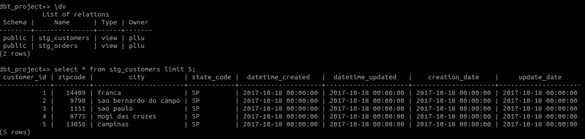

# Postgres dbt tutorial

In previous tutorial, we used dbt to load csv into bigquery database(seeds), then we have done some data transformation(models). In 
this tutorial, we will use postgresql as database server(data warehouse). Instead of loading external csv, we will query
tables (sources) that are already inside the data warehouse.


## 1 create a dbt project

To create a dbt project, use below command: (dbt_project is the name of your project, you can name it as you want)

```shell
dbt init postgres_project
```

After you entered the command, it will ask you which type of database server you will connect to. You need to install
the needed db connector before you create a project. If the connector is installed, you should see it's number. Then
entered the number in the prompt.

**For more details about the project config and layout, please check section 1 of [bigquery_project](../bigquery_project/README.md)**


## 2 Set up db credentials in profiles.yml

To read data from postgres, you need to set up credential to connect to the database server. By default, dbt stores 
these credentials in **~/.dbt/profiles.yml**. 

Below is an example of the generated profiles.yml. It can contain multiple profiles(credentials). Each profile starts with the
name, then followed by a dev and prod credentials. Note for each project you created, dbt will generate a profile for
the project. 

```yaml
# name of the profile
my_dbt_project:
  outputs:

    dev:
      type: postgres
      threads: [1 or more]
      host: [host]
      port: [port]
      user: [dev_username]
      pass: [dev_password]
      dbname: [dbname]
      schema: [dev_schema]

    prod:
      type: postgres
      threads: [1 or more]
      host: [host]
      port: [port]
      user: [prod_username]
      pass: [prod_password]
      dbname: [dbname]
      schema: [prod_schema]

  target: dev

```

You need to edit this file by adding the credentials. Below is an example after adding credentials
```yaml
config:
  send_anonymous_usage_stats: False

# note even though we have set two credential dev and prod. But as we set target is dev.
# so only the dev credential will be used.
local_postgres:
  outputs:

    dev:
      type: postgres
      threads: 1
      host: 127.0.0.1
      port: 5432
      user: pliu
      pass: changeMe
      dbname: dbt_project
      schema: public

    prod:
      type: postgres
      threads: 8
      host: 10.20.30.18
      port: 5432
      user: pliu
      pass: changeMe
      dbname: prod_dbt_project
      schema: public

  target: dev

```

## 3 Read tables and reference them in dbt

dbt provides a feature called **source**. It allows you to name and describe the data (database, tables) already in 
your warehouse. By declaring these tables as sources in dbt, you can then:

- select from source tables in your models using the {{ source() }} function, helping define the lineage of your data
- test your assumptions about your source data
- calculate the freshness of your source data


### 3.1 Declaring a source

Sources are defined in .yml files. For now, I put it in the **schema.yml** which contains test and documentation of all
models

Below is an example of a source called data_mart. It reads three tables (e.g. orders, customers, states) from database
dbt_project in schema public.

```yaml
version: 2

sources:
  - name: data_mart # name of the source
    database: dbt_project # name of the physical database (postgres in this tutorial)
    schema: public # schema of the tables
    tables:
      - name: orders
      - name: customers
      - name: states

```

### 3.2 Use a source

To use a source we can call {{ source('source-name', 'table-name') }}. Below is an example of a model use a source to
create a new model.

```sql
with stg_customers as (
    select *
    from {{ source('data_mart', 'customers') }}
)

select *
from stg_customers
```

When you run **dbt run**, you should see new table/views are created (views in my case). Below is an example

